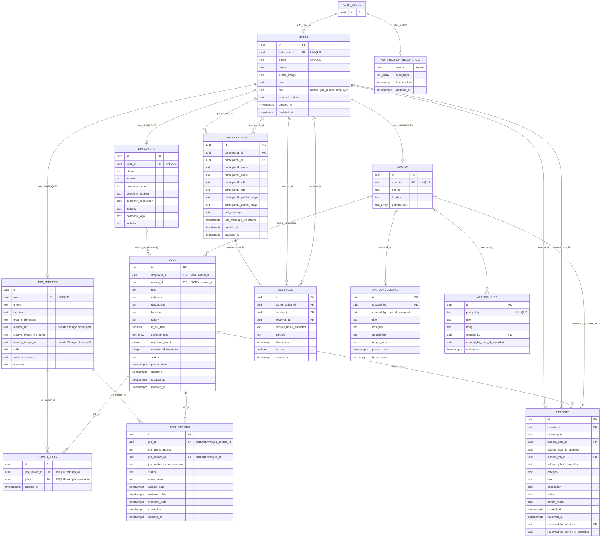

# WorkNest Database Design

This ERD documents the existing mobile recruitment application schema in
[`database_schema.sql`](./database_schema.sql). It keeps the current entities
and distinguishes Supabase Auth IDs from generated public/profile primary keys.

## Crow's Foot ERD

`AUTH_USERS` represents Supabase's managed `auth.users` table. Each profile
table has its own generated `id` primary key. Its unique `user_id` references
`USERS.auth_user_id`, while saved jobs and applications reference the relevant
profile's generated `id`. The three role profiles are mutually exclusive: each
user must have exactly one profile matching `users.role`.

## Relationships and constraints

| Relationship | Key and cardinality | Rule |
| --- | --- | --- |
| Auth account to public user | `users.auth_user_id -> auth.users.id`, unique | An Auth account maps to at most one public user. |
| Public user to role profile | `admins.user_id`, `job_seekers.user_id`, `employers.user_id` -> `users.auth_user_id`, each unique | One profile per account; `users.role` must be exactly `admin`, `job_seeker`, or `employer` and match the single profile. |
| Employer/admin to job listings | `jobs.employer_id -> employers.id` XOR `jobs.admin_id -> admins.id` | Every job belongs to exactly one employer or one admin. Employers can post only under their own profile; admins can post under their own admin profile. Deleting the owning profile cascades to its jobs and dependent applications. There is no separate `created_by` or `employer_name` column on jobs. |
| Seeker to saved jobs | `saved_jobs.job_seeker_id -> job_seekers.id` | Many-to-many seeker/job relationship through `SAVED_JOBS`; unique `(job_seeker_id, job_id)`. |
| Seeker to applications | `applications.job_seeker_id -> job_seekers.id` | A seeker can apply to multiple jobs; one application per `(job_id, job_seeker_id)`. |
| Job to applications | `applications.job_id -> jobs.id` | A job can receive applications from multiple seekers. Job ownership is derived from the one populated owner FK; applications has no owner FK. |
| Conversation participants | `participant1_id`, `participant2_id -> users.auth_user_id` | Two users per conversation; a check prevents self-conversations. |
| Conversation to messages | `messages.conversation_id -> conversations.id` | A conversation contains zero or many messages. |
| Message sender and receiver | `sender_id`, `receiver_id -> users.auth_user_id` | Both are users and must be opposite participants in the conversation; a database trigger and RLS validate the pair. |
| Report creator, subject, reviewer | `reporter_id`, `subject_user_id -> users.auth_user_id`; `subject_job_id -> jobs.id`; `reviewed_by_admin_id -> admins.id` | Explicit subject FKs replace a polymorphic subject ID. Deleted legacy targets are retained as snapshots. |
| Admin-created content | `announcements.created_by`, `app_policies.created_by -> admins.id` | Every announcement has one admin creator; a policy may retain a nullable creator. |
| Auth account to read state | `notification_read_state.user_id -> auth.users.id`, primary key | At most one notification-read state row per Auth user; `user_id` is its primary key, with no generated row ID. |

## Account and email-confirmation provisioning

The `on_auth_user_created` trigger in `database_schema.sql` creates the public
`users` row and matching role profile when a Supabase Auth account is created.
This is required because email-confirmation signup normally has no client
session with which to insert rows under RLS. The migration also backfills
existing seeker/employer Auth accounts that have role metadata but no public
account/profile.

Public signup accepts only `job_seeker` and `employer`. Admin account creation
is restricted to the `admin-create-user` Edge Function, which checks the
authenticated caller's active admin profile before using the Auth Admin API.
Deploy it with `supabase functions deploy admin-create-user`; do not place the
service-role key in the mobile app.

For confirmation links to return to the app, add `worknest://email-verified`
and the deployed web callback URL ending in `/#/email-verified` to Supabase
Authentication > URL Configuration > Redirect URLs. The native URI scheme is
registered in the Android and iOS app configuration; the hosted Supabase
redirect allowlist and email template still need to be configured in the
project dashboard.

## Role authorization and storage setup

The RLS helper functions authorize an administrator only when the authenticated
account has an active `users` row with role `admin` and a matching `admins`
profile. Employer and job-seeker action checks likewise require an active user
whose role matches the corresponding profile. Suspending an account therefore
removes its privileged actions even if its role-profile row remains.

The schema provisions the `avatars` and `resumes` Storage buckets. Avatars are
public, while resumes are private. Resume object paths are saved in
`job_seekers.resume_url` and `resume_image_url`; the app generates short-lived
signed URLs when loading a seeker profile. The owner and active admins can read
the resume, as can an active employer only when the seeker has applied to one
of that employer's jobs. Only active job seekers can upload or replace their
own resume. The migration converts existing Supabase public resume URLs to
object paths and restrictive Storage policies prevent older permissive policies
from re-exposing the private bucket.

Previously issued public resume URLs may remain available in caches until
their existing cache lifetime expires. Treat those old URLs as exposed during
that transition and do not share or reuse them after applying the migration.

The conversation picker calls `conversation_user_directory()`, which returns
only minimal details for active accounts with matching role profiles and
requires the caller to have an active role profile. It is separate from
`admin_list_users()`, which remains restricted to administrator account
management. `get_job_seeker_applicant()` exposes applicant details to admins
and only to active employers who own a job that the seeker applied to; it avoids
granting those employers broad access to `users`. It accepts either the
job-seeker profile ID or the linked Auth user ID, since hydrated application
models use the latter.

Report constraints restrict report type to `job_report`, `applicant_violation`,
`user_report`, or the legacy-compatible `other`; status to `pending`,
`reviewed`, `resolved`, or `dismissed`; and category to the values offered by the app: `inappropriate_content`,
`harassment`, `fraud`, `violates_policy`, and `other`.
Announcement `target_roles` supports `admin`, `job_seeker`, and `employer`
(plus the existing `all` audience selector).

## Normalization notes

- `JOBS.is_saved` is removed because saved state belongs to a seeker/job pair,
  not globally to a job.
- Every job must map to exactly one employer or admin profile. Legacy
  `employer_id` Auth IDs are converted to employer profile IDs; a legacy
  `created_by` is used to recover an employer/admin owner when possible.
  Unmapped or multiply-owned jobs stop the migration for explicit repair.
- `JOBS.created_by` and `JOBS.employer_name` are removed; ownership is
  represented by `JOBS.employer_id` or `JOBS.admin_id`, never both.
- Application ownership is derived through `APPLICATIONS.job_id -> JOBS`; it
  is not stored redundantly.
- Application title and seeker name are retained as historical snapshots.
  Redundant `job_title` and `job_seeker_name` columns are copied into the
  snapshot fields and removed when present.
- Conversation participant and message sender display values are retained as
  snapshots where the existing application uses them. Legacy
  `MESSAGES.sender_name` values are copied into `sender_name_snapshot` before
  the redundant column is removed.
- `APP_POLICIES.policy_key` is non-null and unique because the application
  upserts the singleton default policy by that key. Duplicate legacy keys stop
  the migration with the conflicting policy IDs.
- Distinct user/profile/job IDs are retained so a primary key is not reused as
  a foreign key across unrelated relationships.
- `ANNOUNCEMENTS.created_by` is required and restricts deletion of its admin
  profile. The two reported legacy announcements without recoverable creator
  IDs are attributed to the designated migration admin when present, otherwise
  to the oldest existing admin; new announcements remain creatable by any
  admin. `NOTIFICATION_READ_STATE.user_id` is the table primary key.
- The migration rejects unresolved records such as jobs without exactly one owner,
  announcements without an admin creator, invalid snapshots, duplicate
  junction rows, and invalid foreign-key data. When a user's account type is
  known, conflicting role-profile rows are removed to retain the matching
  profile; dependent records follow their declared FK delete actions.

## Deployment

The schema is an in-place migration, not a database rebuild. Back up the
database and apply the full SQL script to a staging copy first. The repository
change does not execute the migration against the live Supabase project.
